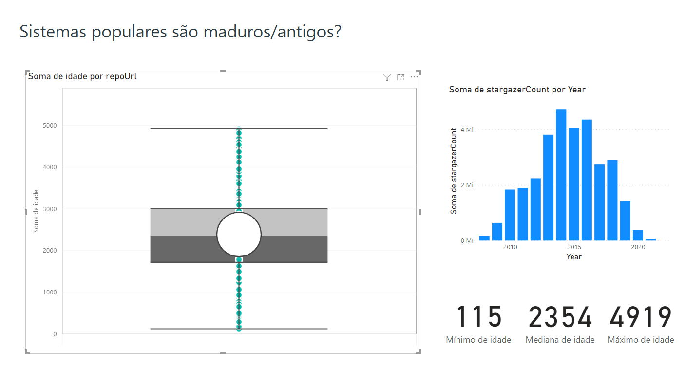

# LabExpSoft01 - Características de Repositórios Populares

**Andrew Costa Silva, andrew.costa@sga.pucminas.br**

**João Guilherme Martins Borborema, jborborema@sga.pucminas.br**

---

Curso de Engenharia de Software, Unidade Praça da Liberdade

_Instituto de Informática e Ciências Exatas – Pontifícia Universidade de Minas Gerais (PUC MINAS), Belo Horizonte – MG – Brasil_

---

## Instruções para executar

- Adicione o texto de token pessoal do Github no arquivo **env**.

- Execute via console `py main.py`

Serão criados 2 arquivos `result_*.csv` com os resultados da consulta.

# Introdução

O presente trabalho tem o objetivo de analisar os 1000 repositórios mais populares do GitHub. Dessa forma, foram-se levantadas algumas perguntas com aspectos interessantes para serem analisados. Primeiramente, será realizado a descrição dessas peguntas e possíveis hipóteses para tais.

- ## Pergunta 1:  Sistemas populares são maduros/antigos?

  - Métrica: idade do repositório (calculado a partir da data de sua criação)
  - Há expectativa de que os repositórios populares, contém projetos bem estuturados e de ótima qualidade, dessa forma, para alcançarem esse tal grau de maturidade, é necessário tempo para aperfeiçoamentos. Além disso, se eles forem projetos maduros, significa que eles estão mais tempo expostos à avaliação dos usuários.

- ## Pergunta 2: Sistemas populares recebem muita contribuição externa?

  - Métrica: total de pull requests aceitas
  - Espera-se que os repositórios mais populares sejam muito bons. Portanto, acredita-se que esses projetos possuam um maior engajamento da comunidade, recebendo muita contribuição externa

- ## Pergunta 3: Sistemas populares lançam releases com frequência?

  - Métrica: total de releases
  - Devido a qualidade e popularidade desses projetos, espera-se que se tenha muitos interessados no desenvolvimento e lançamentos das versões desse projeto, assim, há releases frequentes.

- ## Pergunta 4: Sistemas populares são atualizados com frequência?
    - Métrica: tempo até a última atualização (calculado a partir da data de última atualização)
    - Espera-se que esses projetos sejam atualizados frequentemente pela quantidade de pessoas envolvidas, bem como a necessidade de novas funcionalidades, ajustes ou correção de bugs.

- ## Pergunta 5: Sistemas populares são escritos nas linguagens mais populares [linguagens mais populares](https://octoverse.github.com/)?
    - Métrica: inguagem primária de cada um desses repositórios
    - As linguagens mais populares possuem uma grande quantidade de desenvolvedores que as utilizam e são consideradas bastantes estáveis no desenvolvimento de software, dessa forma, supõem-se que elas também sejam a linguagem primária nos respositórios.

- ## Pergunta 6:  Sistemas populares possuem um alto percentual de issues fechadas?
    - Métrica: razão entre número de issues fechadas pelo total de issues
    - Nos respositórios mais populares, teoricamente ele possuem vários interessados no projeto, dessa forma, as pessoas dessa comunidade tem o objetivo de contribuir no desenvolvimento desse projeto, tendo um maior porcentagem de issues fechadas

- ## Pergunta 7: Sistemas escritos em linguagens mais populares recebem mais contribuição externa, lançam mais releases e são atualizados com mais frequência?
    - Métrica: categoria de linguagens de programação por número de contribuição externa, releases e atualização do projeto
    - Supõem-se que nesses projetos com as linguagens mais utilizadas possuam uma grande quantidade contribuintes, releases e atualização do projeto, pois há mais pessoas capazes de se interessar e contribuir nesses projetos.
# Metodologia

# Resultados
- ## Pergunta 1:  Sistemas populares são maduros/antigos?   
\

A resposta para essa pergunta é não. É possível perceber através do gráfico de "Soma de estrelas por ano" que os repositórios mais antigos não necessariamente possuem mais estrelas, haja vista que esses surgiram em meados de 2015. Além disso, é possível percerber no gráfico box plot algumas  informações como a idade mínima(115 dias), mediana(2354 dias) e máxima(4919)

# Discussão
