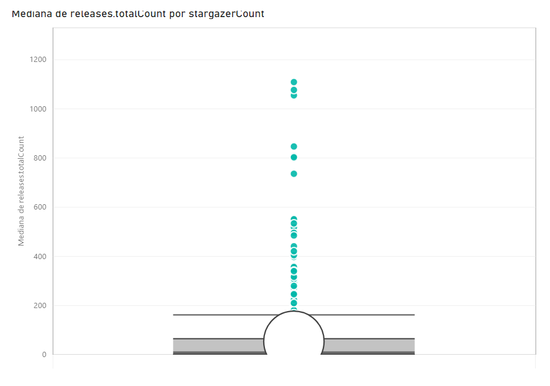

# LabExpSoft01 - Características de Repositórios Populares

**Andrew Costa Silva, andrew.costa@sga.pucminas.br**

**João Guilherme Martins Borborema, jborborema@sga.pucminas.br**

---

Curso de Engenharia de Software, Unidade Praça da Liberdade

_Instituto de Informática e Ciências Exatas – Pontifícia Universidade de Minas Gerais (PUC MINAS), Belo Horizonte – MG – Brasil_

---

## Instruções para executar

- Adicione o texto de token pessoal do Github no arquivo **env**.

- Execute via Jupyter Notebook o arquivo `main.ipynb`

Serão criado um arquivo `pandas.csv` com o resultado da consulta no formato csv.

# Introdução

O presente trabalho tem o objetivo de analisar os 1000 repositórios mais populares do GitHub. Dessa forma, foram-se levantadas algumas perguntas com aspectos interessantes para serem analisados. Primeiramente, será realizado a descrição dessas peguntas e possíveis hipóteses para tais.

- ## Pergunta 1:  Sistemas populares são maduros/antigos?

  - Métrica: idade do repositório (calculado a partir da data de sua criação)
  - Há expectativa de que os repositórios populares, contém projetos bem estuturados e de ótima qualidade, dessa forma, para alcançarem esse tal grau de maturidade, é necessário tempo para aperfeiçoamentos. Além disso, se eles forem projetos maduros, significa que eles estão mais tempo expostos à avaliação dos usuários.

- ## Pergunta 2: Sistemas populares recebem muita contribuição externa?

  - Métrica: total de pull requests aceitas
  - Espera-se que os repositórios mais populares sejam muito bons. Portanto, acredita-se que esses projetos possuam um maior engajamento da comunidade, recebendo muita contribuição externa.

- ## Pergunta 3: Sistemas populares lançam releases com frequência?

  - Métrica: total de releases
  - Devido a qualidade e popularidade desses projetos, espera-se que se tenha muitos interessados no desenvolvimento e lançamentos das versões desse projeto, assim, há releases frequentes.

- ## Pergunta 4: Sistemas populares são atualizados com frequência?

    - Métrica: tempo até a última atualização (calculado a partir da data de última atualização)
    - Espera-se que esses projetos sejam atualizados frequentemente pela quantidade de pessoas envolvidas, bem como a necessidade de novas funcionalidades, ajustes ou correção de bugs.

- ## Pergunta 5: Sistemas populares são escritos nas linguagens mais populares [linguagens mais populares](https://octoverse.github.com/)?
    - Métrica: inguagem primária de cada um desses repositórios
    - As linguagens mais populares possuem uma grande quantidade de desenvolvedores que as utilizam e são consideradas bastantes estáveis no desenvolvimento de software, dessa forma, supõem-se que elas também sejam a linguagem primária nos respositórios.

- ## Pergunta 6:  Sistemas populares possuem um alto percentual de issues fechadas?
    - Métrica: razão entre número de issues fechadas pelo total de issues
    - Nos respositórios mais populares, teoricamente ele possuem vários interessados no projeto, dessa forma, as pessoas dessa comunidade tem o objetivo de contribuir no desenvolvimento desse projeto, tendo um maior porcentagem de issues fechadas

- ## Pergunta 7: Sistemas escritos em linguagens mais populares recebem mais contribuição externa, lançam mais releases e são atualizados com mais frequência?
    - Métrica: categoria de linguagens de programação por número de contribuição externa, releases e atualização do projeto
    - Supõem-se que nesses projetos com as linguagens mais utilizadas possuam uma grande quantidade de contribuintes, releases e atualização do projeto, pois há mais pessoas capazes de se interessar e contribuir nesses projetos.
# Metodologia

Para a realização deste trabalho conduziu-se por meio 4 etapas: levantamento de suposições, construção das consultas, coletas dos dados e a análise dos resultados

## i) Levantamento de suposições

Para cada questão pesquisa discutiu-se entre integrantes sobre elaboração de hipóteses sobre as possíveis respostas.

## ii) Construção das consultas

Inicialmente explorou-se sobre as capacidades de consulta a api GraphQL do GitHub com o intuito de identificar sobre quais colunas seriam necessárias para o desenvolvimento deste trabalho. Com isso, para cada pergunta foi redigido uma consulta e posteriormente mesclou-se em um arquivo de texto.

## iii) Coletas dos dados

O processo de coleta utilizou como a principal ferramenta a linguagem Python na versão 3.9, que em conjunto com as seguintes bibliotecas padrões da linguagem requests para requisições via protocolo HTTP para acesso a Api do GitHub, e as bibliotecas que são Pip Seaborn para construção de gráficos, Pandas para a conversão de JSON (JavaScript Object Notation) para a estrutura de dados dataframe para em consequência armazenar os resultados em .csv.
Em sequência transformou-se as colunas resultantes que possuíam formatos de data para a conversão em dias para que os cálculos estatísticos fossem possíveis de serem realizados.

## iv) Análise dos resultados

Por fim, carregaram-se os dados obtidos para visualização e análise por meio da ferramenta da Microsoft Power Bi e com isso optou-se pela utilização de gráficos seguindo o modelo box-plot devido resumir as métricas e facilitar a exibição de outliers, porém em situações de baixa compreensão do modelo, optou-se pelo modelo de barras e linhas. Além disso, foram utilizadas fórmulas dentro da ferramenta para obtenção de índices nos quais expandiriam as explicações sobre as perguntas levantadas.

# Resultados
 ## Pergunta 1:  Sistemas populares são maduros/antigos?   
\

\
A resposta para essa pergunta é não. É possível perceber através do gráfico de "Soma de estrelas por ano" que os repositórios mais antigos não necessariamente possuem mais estrelas, haja vista que esses surgiram em meados de 2015. Além disso, é possível percerber no gráfico box plot algumas  informações como a idade mínima(115 dias), mediana(2354 dias) e máxima(4919)

## Pergunta 2:   Sistemas populares recebem muita contribuição externa?
\

\
Como mostrado no gráfico acima, os sistemas mais populares não possuem tanta contribuição externa, exemplo disso, é o repositório  [homebrew-cask](https://github.com/Homebrew/homebrew-cask) que possui o maior número de pull requests (89061), mas possui apenas 18470 estrelas. Em contra partida, o [freeCodeCamp](https://github.com/freeCodeCamp/freeCodeCamp
) que possui a maior quantidade de estrelas (329227) tem apenas 15354 pull requests.

## Pergunta 3:   Sistemas populares lançam releases com frequência?
\

\
A relação entre número de releases e a popularidade do repositório varia muito, ao se analisar a média do número de releases, obtém-se 54, enquanto a mediana é de 14, que demonstra que alguns repositórios desequilibram essa
métrica.
\
## Pergunta 4: Sistemas populares são atualizados com frequência?
\

\
Como é possível visualizar no gráfico acima, os repositórios mais populares também são aqueles mais atualizados, além disso, é válido ressaltar que como um todo esses repositórios são atualizados frequentemente, pois o maior tempo de não atualizações foi de apenas 4 dias.
\
## Pergunta 5: Sistemas populares são escritos nas  [linguagens mais populares](https://octoverse.github.com/)?
\

Ao realizar a comparação entre a pesquisa do Octoverse com as linguagens prioritárias dos repositórios mais populares, é possível perceber algumas similaridades entre ambas pesquisas, como a grande utilização de linguagens como Javascript, Python, Java, Typescript, C#, C e também alguns aspectos interessantes, como a categoria "none" que representa repositórios que possuem muitos arquivos (.md, .pdf., .png, etc.), bem como a aparição da linguagem GO, demonstrando um ótimo crescimento em 2021.
\
## Pergunta 6: Sistemas populares possuem um alto percentual de issues fechadas?

Analizando os dados acima, é possível perceber que de fato os repositórios populares tem uma grande porcentagem de issues fechadas, pois possuem uma mediana de 85,8 % e média de 77,3 %. Além disso, fizemos uma tratativa de considerar aqueles repositórios que não possuiam nenhuma issue fechada com 0%.

## Pergunta 7: Sistemas escritos em linguagens mais populares recebem mais contribuição externa, lançam mais releases e são atualizados com mais frequência?

\

\

Quanto aos pull requests desses repositórios, nota-se que há algumas linguagens se sobressaem, como as tradicionais C++, Python e Java, e também o aumento do uso da linguagem C e Typescript.

Analisando a quantidade de releases, percebe-se que também há linguagens já estabelecidas, mas é válido ressaltar que as primeiras colocadas são Typescript e Go que são linguagens mais recentes se comparada com as demais

Em relãção à frequência de atualizações, é percebido que há algumas linguagens não tão comuns, como Swift e HTML, entretanto também há linguagens muito populares.
# Discussão

- ## Pergunta 1:  Sistemas populares são maduros/antigos?
  - Havia a expectativa de que os repositórios mais antigos teriam uma maior quantidade de estrelas, mas foi notado que isso era falso, pois os repositórios mais populares surgiram em meados de 2015, enquanto os primeiros repositórios não possuem os maiores índices de estrela.

- ## Pergunta 2: Sistemas populares recebem muita contribuição externa?
  - Esperava-se que os repositórios mais populares possuiriam uma comunidade mais engajada, fazendo mais contribuições no projeto, entretanto não foi o resultado encontrado, ao se perceber que alguns repositórios não tão populares possuíam as maiores quantidades de pull requests.

- ## Pergunta 3: Sistemas populares lançam releases com frequência?

  - A expectativa era de que os projetos mais populares possuíssem muitos steakholders que contribuíssem e incentivassem o projeto, entretanto notou-se que esse fator varia muito tendo alguns projetos com muitas releases.

- ## Pergunta 4: Sistemas populares são atualizados com frequência?

  - Como já se suspeitava, de fato esses repositórios são frequentemente atualizados, validando a hipótese de que há muitas pessoas envolvidas no projeto e que há a necessidade de aprimorar o conteúdo frequentemente.

- ## Pergunta 5: Sistemas populares são escritos nas linguagens mais populares [linguagens mais populares](https://octoverse.github.com/)?

  - Foi possível notar que de fato as linguagens mais populares também estão presentes nos repositórios, pois essas já estão bem estabelecidas no mercado. Também é válido ressaltar que há repositórios sem linguagem de programação e o aumento do uso da linguagem GO.

- ## Pergunta 6: Sistemas populares possuem um alto percentual de issues fechadas?

  - A hipótese foi justificada ao se ter grandes taxas de issues fechadas nesses repositórios, mostrando que há um grande envolvimento em volta desses repositórios.

- ## Pergunta 7: Sistemas escritos em linguagens mais populares recebem mais contribuição externa, lançam mais releases e são atualizados com mais frequência?
  - Como se era esperado,  as linguagens de programção mais populares foram muito usadas nesses projetos, e também é possível notar o crescimento de algumas outras linguagens como GO e Typescript.